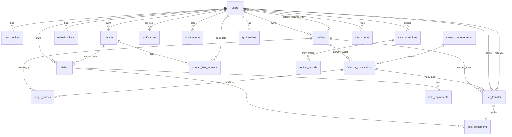

# ERD And Database Specification

## Database Notes
- Recommended relational engine: PostgreSQL.
- All primary business entities use `uuid` primary keys.
- Monetary values use `numeric(18,2)`.
- Exchange rates use `numeric(18,6)`.
- Timestamps use `timestamptz`.
- Enumerations may be native database enums or validated strings.
- All write APIs should accept `client_generated_id` and `idempotency_key` for sync-safe replay.

## Tables

### `users`
| Field | Type | Notes |
| --- | --- | --- |
| id | uuid pk | Primary key |
| full_name | varchar(150) | Required |
| phone_number | varchar(32) unique | Required, normalized E.164 |
| password_hash | varchar(255) | Required |
| otp_verified_at | timestamptz null | Set after verification |
| public_reference_code | varchar(32) unique | Used in QR/public identity |
| default_receiving_wallet_id | uuid fk wallets.id null | Default inbound transfer destination |
| status | varchar(20) | `active`, `locked`, `disabled` |
| last_login_at | timestamptz null |  |
| created_at | timestamptz |  |
| updated_at | timestamptz |  |

Indexes:
- unique `users_phone_number_uq (phone_number)`
- unique `users_public_reference_code_uq (public_reference_code)`
- index `users_status_idx (status)`
- index `users_default_receiving_wallet_idx (default_receiving_wallet_id)`

### `user_devices`
| Field | Type | Notes |
| --- | --- | --- |
| id | uuid pk |  |
| user_id | uuid fk users.id |  |
| device_identifier | varchar(128) | Client/device id |
| device_name | varchar(150) null |  |
| platform | varchar(20) | `android`, `ios`, `web` |
| biometric_enabled | boolean | Default false |
| biometric_public_key | text null | Future-ready |
| last_used_at | timestamptz null | Last authenticated or refreshed use |
| created_at | timestamptz |  |
| updated_at | timestamptz |  |

Indexes:
- unique `user_devices_user_device_uq (user_id, device_identifier)`
- index `user_devices_last_used_idx (last_used_at)`

### `refresh_tokens`
| Field | Type | Notes |
| --- | --- | --- |
| id | uuid pk |  |
| user_id | uuid fk users.id |  |
| user_device_id | uuid fk user_devices.id null |  |
| token_hash | varchar(255) unique | Store hashed refresh token |
| expires_at | timestamptz |  |
| revoked_at | timestamptz null |  |
| created_at | timestamptz |  |

Indexes:
- unique `refresh_tokens_token_hash_uq (token_hash)`
- index `refresh_tokens_user_idx (user_id, revoked_at)`

### `otp_challenges`
| Field | Type | Notes |
| --- | --- | --- |
| id | uuid pk |  |
| user_id | uuid fk users.id null | Null for pre-registration flows if needed |
| phone_number | varchar(32) |  |
| purpose | varchar(30) | `register`, `reset_password`, `login_verify` |
| otp_hash | varchar(255) |  |
| expires_at | timestamptz |  |
| consumed_at | timestamptz null |  |
| attempt_count | integer | Default 0 |
| created_at | timestamptz |  |

Indexes:
- index `otp_challenges_phone_purpose_idx (phone_number, purpose, consumed_at)`
- index `otp_challenges_expires_idx (expires_at)`

### `password_reset_requests`
| Field | Type | Notes |
| --- | --- | --- |
| id | uuid pk |  |
| user_id | uuid fk users.id |  |
| reset_token_hash | varchar(255) unique |  |
| expires_at | timestamptz |  |
| consumed_at | timestamptz null |  |
| created_at | timestamptz |  |

Indexes:
- unique `password_reset_requests_token_hash_uq (reset_token_hash)`

### `wallets`
| Field | Type | Notes |
| --- | --- | --- |
| id | uuid pk |  |
| user_id | uuid fk users.id | Owner |
| client_generated_id | uuid null | Offline-created id |
| name | varchar(120) | Required |
| status | varchar(20) | `active`, `archived` |
| archived_at | timestamptz null |  |
| restored_at | timestamptz null | Last restore timestamp |
| created_at | timestamptz |  |
| updated_at | timestamptz |  |
| version | integer | Optimistic concurrency |

Indexes:
- index `wallets_user_status_idx (user_id, status)`
- index `wallets_user_created_idx (user_id, created_at desc)`

### `transaction_references`
| Field | Type | Notes |
| --- | --- | --- |
| id | bigint pk |  |
| reference_year | integer |  |
| sequence_number | bigint |  |
| reference_code | varchar(32) unique | `TX-YYYY-######` |
| created_at | timestamptz |  |

Indexes:
- unique `transaction_references_code_uq (reference_code)`
- unique `transaction_references_year_seq_uq (reference_year, sequence_number)`

### `financial_transactions`
| Field | Type | Notes |
| --- | --- | --- |
| id | uuid pk | Aggregate id |
| user_id | uuid fk users.id | Actor/owner |
| wallet_id | uuid fk wallets.id | Primary wallet |
| destination_wallet_id | uuid fk wallets.id null | Internal transfer only |
| transaction_reference_id | bigint fk transaction_references.id |  |
| client_generated_id | uuid null | Offline-created id |
| idempotency_key | varchar(128) unique | Replay-safe |
| type | varchar(30) | `deposit`, `withdraw`, `internal_transfer`, `exchange`, `user_transfer` |
| currency | varchar(3) null | Used for single-currency flows |
| source_currency | varchar(3) null | Exchange |
| destination_currency | varchar(3) null | Exchange |
| amount | numeric(18,2) null | Single amount |
| amount_given | numeric(18,2) null | Exchange source amount |
| exchange_rate | numeric(18,6) null | User-entered |
| amount_received | numeric(18,2) null | User-entered |
| note | text null |  |
| attachment_count | integer | Default 0 |
| created_at | timestamptz | Immutable event time |
| created_by_device_id | uuid fk user_devices.id null |  |
| version | integer | For sync reconciliation only |

Indexes:
- unique `financial_transactions_idempotency_key_uq (idempotency_key)`
- index `financial_transactions_user_created_idx (user_id, created_at desc)`
- index `financial_transactions_wallet_created_idx (wallet_id, created_at desc)`
- index `financial_transactions_type_idx (type, created_at desc)`

### `ledger_entries`
| Field | Type | Notes |
| --- | --- | --- |
| id | uuid pk |  |
| financial_transaction_id | uuid fk financial_transactions.id |  |
| wallet_id | uuid fk wallets.id | Affected wallet |
| direction | varchar(10) | `credit`, `debit` |
| currency | varchar(3) | `USD`, `SYP` |
| amount | numeric(18,2) | Positive number |
| related_user_id | uuid fk users.id null | Used in user transfers |
| linked_transfer_id | uuid fk user_transfers.id null |  |
| linked_debt_settlement_id | uuid fk debt_settlements.id null |  |
| created_at | timestamptz |  |

Indexes:
- index `ledger_entries_wallet_currency_idx (wallet_id, currency, created_at)`
- index `ledger_entries_transaction_idx (financial_transaction_id)`

### `user_transfers`
| Field | Type | Notes |
| --- | --- | --- |
| id | uuid pk |  |
| sender_user_id | uuid fk users.id |  |
| sender_wallet_id | uuid fk wallets.id |  |
| recipient_user_id | uuid fk users.id |  |
| recipient_wallet_id | uuid fk wallets.id null | Explicit destination or resolved from default_receiving_wallet_id |
| financial_transaction_id | uuid fk financial_transactions.id | Canonical money movement |
| reference_code | varchar(32) unique | Transfer-facing ref if separate |
| currency | varchar(3) |  |
| amount | numeric(18,2) |  |
| note | text null |  |
| created_at | timestamptz |  |

Indexes:
- index `user_transfers_sender_idx (sender_user_id, created_at desc)`
- index `user_transfers_recipient_idx (recipient_user_id, created_at desc)`

### `contacts`
| Field | Type | Notes |
| --- | --- | --- |
| id | uuid pk |  |
| owner_user_id | uuid fk users.id | Contact owner |
| type | varchar(20) | `external`, `registered` |
| display_name | varchar(150) |  |
| phone_number | varchar(32) null |  |
| note | text null |  |
| linked_user_id | uuid fk users.id null | For registered or linked contacts |
| link_status | varchar(20) | `none`, `pending`, `linked`, `rejected` |
| created_at | timestamptz |  |
| updated_at | timestamptz |  |
| archived_at | timestamptz null | Optional future support |
| version | integer |  |

Indexes:
- index `contacts_owner_type_idx (owner_user_id, type)`
- index `contacts_owner_name_idx (owner_user_id, display_name)`
- index `contacts_phone_idx (phone_number)`

### `contact_link_requests`
| Field | Type | Notes |
| --- | --- | --- |
| id | uuid pk |  |
| owner_user_id | uuid fk users.id | Contact owner |
| contact_id | uuid fk contacts.id | External contact |
| candidate_user_id | uuid fk users.id | Registered account candidate |
| owner_approved_at | timestamptz null |  |
| candidate_approved_at | timestamptz null |  |
| rejected_at | timestamptz null |  |
| status | varchar(20) | `pending`, `approved`, `rejected`, `expired` |
| created_at | timestamptz |  |
| updated_at | timestamptz |  |

Indexes:
- index `contact_link_requests_contact_idx (contact_id, status)`
- index `contact_link_requests_candidate_idx (candidate_user_id, status)`

### `debts`
| Field | Type | Notes |
| --- | --- | --- |
| id | uuid pk |  |
| owner_user_id | uuid fk users.id | User who owns the record |
| contact_id | uuid fk contacts.id | Counterparty |
| direction | varchar(20) | `owed_to_me`, `i_owe` |
| currency | varchar(3) |  |
| original_amount | numeric(18,2) |  |
| note | text null |  |
| status | varchar(20) | `open`, `completed` |
| created_at | timestamptz |  |
| updated_at | timestamptz |  |
| version | integer |  |

Indexes:
- index `debts_owner_direction_idx (owner_user_id, direction, status)`
- index `debts_contact_idx (contact_id, status)`

### `debt_repayments`
| Field | Type | Notes |
| --- | --- | --- |
| id | uuid pk |  |
| debt_id | uuid fk debts.id |  |
| amount | numeric(18,2) |  |
| note | text null |  |
| created_at | timestamptz | Immutable |
| created_by_device_id | uuid fk user_devices.id null |  |

Indexes:
- index `debt_repayments_debt_created_idx (debt_id, created_at)`

### `debt_settlements`
| Field | Type | Notes |
| --- | --- | --- |
| id | uuid pk |  |
| debt_id | uuid fk debts.id |  |
| user_transfer_id | uuid fk user_transfers.id | Linked transfer |
| amount | numeric(18,2) |  |
| note | text null |  |
| created_at | timestamptz | Immutable |
| created_by_device_id | uuid fk user_devices.id null |  |

Indexes:
- index `debt_settlements_debt_created_idx (debt_id, created_at)`
- unique `debt_settlements_transfer_uq (user_transfer_id)`

### `qr_identities`
| Field | Type | Notes |
| --- | --- | --- |
| id | uuid pk |  |
| user_id | uuid fk users.id unique |  |
| public_reference_code | varchar(32) unique | Public lookup |
| payload_version | integer |  |
| generated_at | timestamptz |  |
| rotated_at | timestamptz null | Future rotation support |

Indexes:
- unique `qr_identities_user_uq (user_id)`
- unique `qr_identities_public_ref_uq (public_reference_code)`

### `attachments`
| Field | Type | Notes |
| --- | --- | --- |
| id | uuid pk |  |
| owner_user_id | uuid fk users.id |  |
| entity_type | varchar(30) | `transaction`, `debt`, `debt_settlement`, `contact` |
| entity_id | uuid | Parent entity id |
| original_file_name | varchar(255) |  |
| content_type | varchar(120) |  |
| file_size_bytes | bigint |  |
| storage_key | varchar(255) | Object store or path |
| checksum_sha256 | varchar(64) null |  |
| upload_status | varchar(20) | `local_only`, `pending`, `uploaded`, `failed` |
| created_at | timestamptz |  |
| deleted_at | timestamptz null | Soft delete supported |
| version | integer |  |

Indexes:
- index `attachments_owner_entity_idx (owner_user_id, entity_type, entity_id)`
- index `attachments_upload_status_idx (upload_status)`

### `notifications`
| Field | Type | Notes |
| --- | --- | --- |
| id | uuid pk |  |
| user_id | uuid fk users.id | Recipient |
| type | varchar(30) |  |
| title | varchar(160) |  |
| body | text |  |
| related_entity_type | varchar(30) null |  |
| related_entity_id | uuid null |  |
| payload_json | jsonb | Extra rendering data |
| read_at | timestamptz null |  |
| created_at | timestamptz |  |

Indexes:
- index `notifications_user_created_idx (user_id, created_at desc)`
- index `notifications_user_read_idx (user_id, read_at)`

### `audit_events`
| Field | Type | Notes |
| --- | --- | --- |
| id | uuid pk |  |
| actor_user_id | uuid fk users.id null | System events may be null |
| event_type | varchar(40) |  |
| related_entity_type | varchar(30) |  |
| related_entity_id | uuid |  |
| device_identifier | varchar(128) null | Future-ready |
| sync_status | varchar(20) null | Snapshot at creation time |
| metadata_json | jsonb |  |
| created_at | timestamptz | Immutable |

Indexes:
- index `audit_events_entity_idx (related_entity_type, related_entity_id, created_at desc)`
- index `audit_events_actor_idx (actor_user_id, created_at desc)`
- index `audit_events_type_idx (event_type, created_at desc)`

### `sync_operations`
| Field | Type | Notes |
| --- | --- | --- |
| id | uuid pk |  |
| user_id | uuid fk users.id |  |
| device_identifier | varchar(128) |  |
| operation_type | varchar(40) |  |
| status | varchar(20) | `pending`, `synced`, `failed`, `conflict` |
| entity_type | varchar(30) |  |
| entity_id | uuid null | Local or server entity |
| client_generated_id | uuid null |  |
| idempotency_key | varchar(128) unique |  |
| base_version | integer null | Client version when queued |
| payload_json | jsonb | Submitted command |
| server_response_json | jsonb null | Last server response |
| error_code | varchar(60) null |  |
| error_message | text null |  |
| created_at | timestamptz |  |
| updated_at | timestamptz |  |
| synced_at | timestamptz null |  |

Indexes:
- unique `sync_operations_idempotency_key_uq (idempotency_key)`
- index `sync_operations_user_status_idx (user_id, status, created_at)`
- index `sync_operations_type_status_idx (operation_type, status)`

### `conflict_records`
| Field | Type | Notes |
| --- | --- | --- |
| id | uuid pk |  |
| sync_operation_id | uuid fk sync_operations.id |  |
| entity_type | varchar(30) |  |
| entity_id | uuid null |  |
| resolution_strategy | varchar(30) | `server_wins`, `client_wins`, `manual_review`, `merge` |
| local_payload_json | jsonb |  |
| remote_payload_json | jsonb |  |
| summary | text |  |
| status | varchar(20) | `open`, `resolved`, `ignored` |
| resolved_at | timestamptz null |  |
| created_at | timestamptz |  |

Indexes:
- index `conflict_records_operation_idx (sync_operation_id)`
- index `conflict_records_status_idx (status, created_at desc)`

## Mermaid ERD

## Derived Read Models
The following should be computed from base tables rather than stored as authoritative balance fields:
- wallet USD balance
- wallet SYP balance
- total dashboard USD
- total dashboard SYP
- debt repaid amount
- debt settled amount
- debt remaining amount

Suggested implementation:
- SQL views
- materialized views
- query-side service aggregation

The backend may cache these read models, but the source of truth remains immutable base records.

## Additional Integrity Rules
- `users.default_receiving_wallet_id` must reference a wallet owned by the same user.
- If a wallet is archived and is currently referenced by `users.default_receiving_wallet_id`, the backend must either:
  - reject the archive request, or
  - require reassignment of `default_receiving_wallet_id` within the same transaction.
- Restoring a wallet does not automatically make it the default receiving wallet unless explicitly requested.
